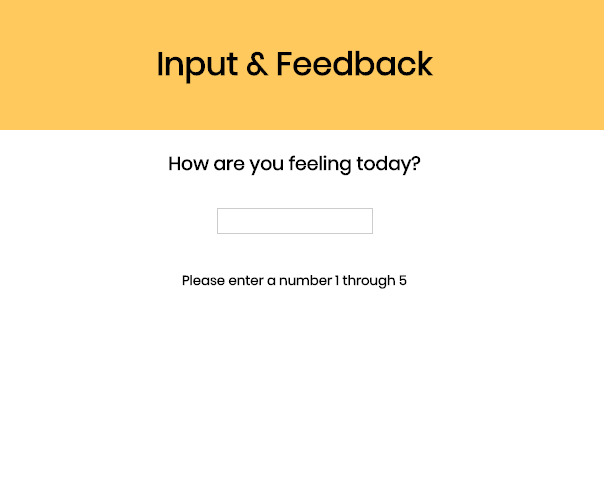
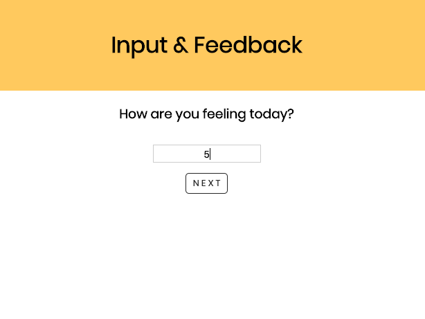
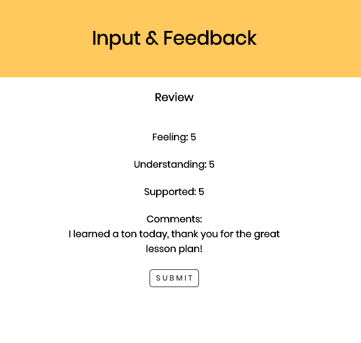

# Input & Feedback

## Description
This is a feedback form for educators that is used to gather daily input from their students. It is meant to be used at the end of the day to gauge how well students are retaining the information, and any difficulties they may have. Educators are then able to better structure lesson plans the following day and throughout the week. This creates a learning environment that is open, communicative, and adaptive. The form is simple, straight-forward and questions are distilled to only the most pertinent. This minimizes the time it takes to both fill out and read the form, making it painless for both students and educators. 

## Technologies Used

- React
- Redux
- Javascript
- Node
- Express
- Axios
- HTML
- CSS

## Project Images

### Main view

### Main view input
 

### Review view

## Installation

- Visit Heroku at
- https://input-and-feedback.herokuapp.com/#/

## Contact

- Brooks Geenen
- brgeen@gmail.com

